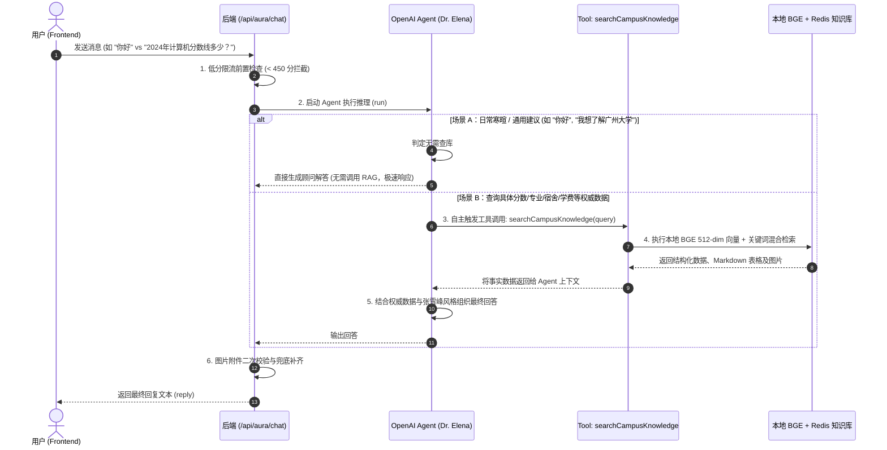

# 引入 @openai/agents 优化招生咨询回复流程 (单 Agent + 智能按需 RAG)

根据最新需求，**暂不采用多 Agent 复杂分流**，而是聚焦于最核心的痛点优化：
👉 **原流程痛点**：无论用户发送什么（即使是“你好”、“在吗”或泛交流），后端都会强制无脑执行一次 BGE 向量生成 + Redis + 数据库 RAG 检索，既浪费计算资源，又导致 Prompt 冗长。
👉 **重构后优化点**：引入 `@openai/agents` 单 Agent 架构，将 RAG 知识库封装为 Agent 工具（Tool）。**由 AI 根据用户语义自主决定是否需要调用 RAG 检索校方数据**，实现“日常对话零延迟秒回，精准事实按需查库”。

---

## 优化后架构流程图

---

## 核心设计与改造细节

### 1. 单 Agent 设计 (`Dr. Elena`)
* **定位**：张雪峰式实用主义招生顾问，根据学生高考画像（省份/分数/选科）给出中肯建议。
* **自主决策原则**：
  * 遇到“历年录取分数线、排位、专业设置、宿舍实景环境、学费与资助政策”等具体事实问题，**主动调用 `searchCampusKnowledge` 工具**。
  * 遇到日常问候、报考心态疏导、通用常识时，直接作答，不触发工具。
  * 对话中感知到考生的明确意向（如“我想去大湾区读计算机，预算有限”），自主调用 `saveUserPreference` 工具沉淀档案。

### 2. 工具封装 (`tool` from `@openai/agents` + `zod`)
* **`searchCampusKnowledge`**：
  * **参数**：`{ query: z.string().describe("针对校方知识库的检索关键词或具体问题") }`
  * **内部实现**：复用现有的 `searchRagEngine(query, 3)`（BGE 512-dim 向量模型 + Redis 高速缓存）。
  * **返回值**：知识项说明、Markdown 表格以及实景图片 Markdown 语法。
* **`searchPersonalMemory`**（VIP 考生适用）：
  * **参数**：`{ query: z.string().describe("检索考生过往偏好与历史诉求的关键词") }`
  * **内部实现**：调用 `searchUserPersonalRagEngine` 检索考生专属记忆。
* **`saveUserPreference`**：
  * **参数**：`{ preference: z.string().describe("考生表达的明确志愿/专业/地域偏好或特殊要求") }`
  * **内部实现**：调用 `saveUserPersonalMemory` 自动入库持久化。

### 3. 多模型适配与全链路降级
* **模型支持**：无缝兼容 `DEEPSEEK_API_KEY`（通过 `setDefaultOpenAIClient` + `setOpenAIAPI('chat_completions')`）以及标准 `OPENAI_API_KEY`。
* **离线降级机制**：若未配置 API Key 或网络调用异常，保留现有的本地 RAG 自动兜底回复（`source: 'local-bge-rag-db'`），保障服务 100% 可用。

---

## Proposed Changes

### 1. 依赖管理 (`package.json`)
#### [MODIFY] [package.json](file:///c:/Users/meru6/Desktop/Gzadm%20Navigator/package.json)
* 安装 `@openai/agents`、`openai`、`zod`。

---

### 2. 后端服务 (`server.mjs`)
#### [MODIFY] [server.mjs](file:///c:/Users/meru6/Desktop/Gzadm%20Navigator/server.mjs)
* 引入 `@openai/agents` 的 `Agent`, `tool`, `run`, `setDefaultOpenAIClient`, `setOpenAIAPI`。
* 将现有的 RAG 检索、记忆检索与记忆保存逻辑包装为标准 Agent `tool`。
* 定义统一的 `admissionsAgent`。
* 重构 `/api/aura/chat` 接口，调用 `run(admissionsAgent, ...)`，由 Agent 自主决定是否调用 RAG 工具。
* 保持 API 接口入参和出参格式不变，前端 `aurasense.tsx` 零改动平滑兼容。

---

## Verification Plan

### 自动化与依赖测试
1. 执行 `npm install @openai/agents openai zod` 安装依赖。
2. 启动服务 `node server.mjs` 验证启动日志与 Agent 初始化。

### 核心功能场景测试
1. **测试 A（不触发 RAG）**：
   - 发送：“你好，你是谁？能帮我做些什么？”
   - 验证：AI 直接回答，控制台不产生无谓的 RAG 向量计算与缓存开销。
2. **测试 B（自主触发 RAG 查分数）**：
   - 发送：“请问浙江考生报计算机科学与技术，近年的录取分数线和排位是多少？”
   - 验证：AI 识别意图，自动调用 `searchCampusKnowledge` 工具，并以 Markdown 表格准确输出分数线。
3. **测试 C（自主触发 RAG 查宿舍）**：
   - 发送：“学校宿舍几人间？有空调和独卫吗？有实景图吗？”
   - 验证：AI 自主调用工具，回答包含宿舍标准配置与实景图 Markdown。
4. **测试 D（低分限流与离线兜底）**：
   - 模拟填报 420 分，确认被低分限流规则拦截。
   - 在无 API Key 场景下，确认能够正常降级返回本地 RAG 数据。
